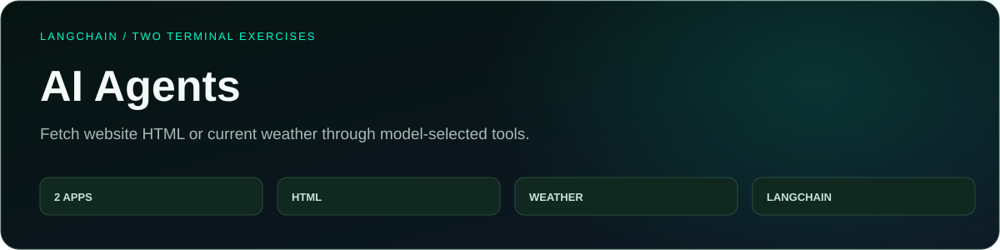

<p align="center">
  
</p>

<p align="center">
  <a href="#running-locally"></a>
  <a href="https://github.com/itaygoldenberg/ai-agents"></a>
  <a href="https://github.com/itaygoldenberg?tab=repositories"></a>
  <a href="https://www.linkedin.com/in/itay-goldenberg/"></a>
</p>

<p align="center">
  <a href="#overview">Overview</a>&nbsp;&middot;&nbsp;
  <a href="#features">Features</a>&nbsp;&middot;&nbsp;
  <a href="#workflow">Workflow</a>&nbsp;&middot;&nbsp;
  <a href="#technology">Technology</a>&nbsp;&middot;&nbsp;
  <a href="#running-locally">Running locally</a>
</p>

> [!NOTE]
> A full-stack course portfolio project by Itay Goldenberg. Fetch website HTML or current weather through model-selected tools.

## Overview

This repository contains two independent terminal applications. Summary Agent fetches a webpage and asks the model for a one-sentence summary. Weather Agent fetches a city’s current weather from wttr.in.

Each application defines its own LangChain agent, Zod tool schema, configuration and logger. The tool result returns to the agent, which uses it to produce the final response.

<table><tr><td align="center" width="25%"><strong>2 APPS</strong><br /><sub>independent agents</sub></td><td align="center" width="25%"><strong>HTML</strong><br /><sub>website summary</sub></td><td align="center" width="25%"><strong>WEATHER</strong><br /><sub>city lookup</sub></td><td align="center" width="25%"><strong>LANGCHAIN</strong><br /><sub>typed tool calls</sub></td></tr></table>

| Project detail | Implementation |
|---|---|
| LangChain + OpenAI | Both agents |
| Zod | URL and city argument schemas |
| Node.js fetch | Webpage and weather requests |
| TypeScript + tsx | Independent terminal programs |

## Contents

- [Overview](#overview)
- [Features](#features)
- [Workflow](#workflow)
- [Technology](#technology)
- [Project structure](#project-structure)
- [Running locally](#running-locally)
- [Checks](#checks)
- [Additional details](#additional-details)
- [Operational notes](#operational-notes)
- [Author](#author)

## Features

### Website summary

The get-html tool validates the URL, fetches raw HTML and returns its first 20,000 characters. The system prompt asks for one short sentence.

### Current weather lookup

The get-weather tool URL-encodes the city and requests wttr.in with `format=3`.

### Separate application configuration

Each folder has its own package.json, `.env.example`, terminal entry point and dependencies.

### Tool message logging

The logger shows returned agent and tool messages, making executed operations inspectable.

## Workflow

<p align="center">
  
</p>

1. **TERMINAL:** Ask about a website or a city.
2. **SELECTED AGENT:** Summary Agent or Weather Agent.
3. **FETCH TOOL:** HTML excerpt or wttr.in response.
4. **MODEL RESPONSE:** One-sentence summary or weather answer.

## Technology

<p align="center">
  
</p>

| Technology | Role |
|---|---|
| LangChain + OpenAI | Both agents |
| Zod | URL and city argument schemas |
| Node.js fetch | Webpage and weather requests |
| TypeScript + tsx | Independent terminal programs |

## Project structure

```text
Summary Agent/
  src/agent/       Summary agent, HTML tool and logger
  src/utils/       Config and terminal input
Weather Agent/
  src/agent/       Weather agent, weather tool and logger
  src/utils/       Config and terminal input
docs/              README artwork
```

## Running locally

Clone the repository, then follow the application-specific steps below. Commands assume the repository root unless a directory change is shown.

```bash
git clone https://github.com/itaygoldenberg/ai-agents.git
cd ai-agents
```

Use Node.js with built-in fetch. Start either application from its own directory:

```bash
cd "Summary Agent"
```

Copy `.env.example` to `.env` in this application directory and configure it before starting:

```env
OPENAI_API_KEY=your_openai_api_key
```

```bash
npm install
npm start
```

For the second application, open a terminal at the repository root, enter `Weather Agent`, and repeat the environment setup, installation and start commands. Each application needs its own `.env`.

## Checks

Neither application defines a build or automated test script. Run the summary agent against a small public page and compare its response with the page. Run the weather agent with a city name and verify the get-weather tool result. Both checks consume model API usage.

These are available build commands and suggested manual checks, not a claim that a full integration test suite is included.

## Additional details

| Application | Tool input | External result |
|---|---|---|
| Summary Agent | Website URL | First 20,000 characters of fetched HTML |
| Weather Agent | City name | wttr.in text response |

## Operational notes

The HTML tool fetches the response body without running browser JavaScript, so client-rendered pages may provide little content. Weather availability depends on wttr.in. Both tools return fetch errors as strings. Logged execution messages are not private model reasoning.

## Author

<p align="center">
  <strong>Itay Goldenberg</strong><br />
  <sub>Full Stack Developer Student &middot; John Bryce</sub>
</p>

<p align="center">
  <a href="https://github.com/itaygoldenberg"></a>
  <a href="https://www.linkedin.com/in/itay-goldenberg/"></a>
</p>
